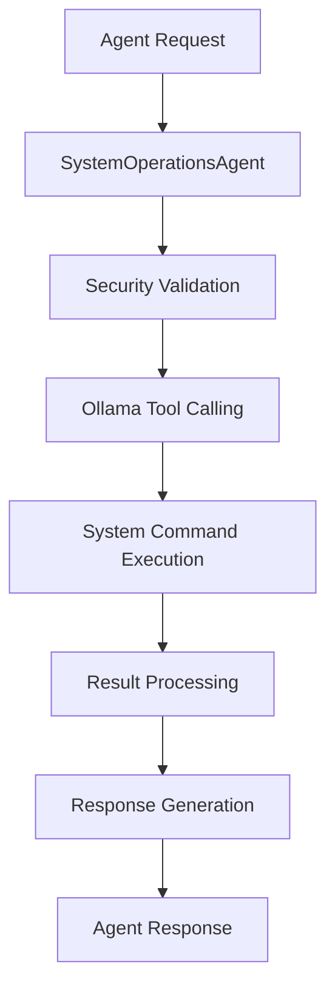

# 🚀 **SO Powers Strategy - Agent Superuser Capabilities with Ollama**

## 🎯 **Executive Summary**

This document outlines the strategic implementation of **Superuser (SO) powers** for our autonomous agents, enabling them to perform system-level operations through Ollama integration. This represents a significant evolution from basic LLM interactions to full system control capabilities.

## 🏗️ **Architecture Overview**

### **Core Components**

1. **SystemOperationsAgent** - Primary SO powers engine
2. **Ollama Tool Calling** - Direct system command execution
3. **Security Policy Engine** - Command validation and safety
4. **Automation Framework** - Scheduled and triggered operations
5. **Resource Management** - CPU, memory, disk, network, GPU control

### **Integration Strategy**



## 🔧 **Implementation Plan**

### **Phase 1: Core SO Powers (Immediate)**

#### **1.1 System Command Execution**
```typescript
// Direct command execution with validation
const result = await systemOps.executeSystemCommand('ls -la', {
  timeout: 30000,
  workingDirectory: '/home/user',
  captureOutput: true,
  validateOutput: true
});
```

#### **1.2 File System Operations**
```typescript
// Complete file system control
await systemOps.manageFileSystem({
  type: 'write',
  path: '/tmp/agent-output.txt',
  content: 'Agent generated content',
  options: { permissions: '644' }
});
```

#### **1.3 Process Management**
```typescript
// Process control capabilities
await systemOps.manageProcesses({
  type: 'start',
  command: 'npm start',
  options: { detached: true, cwd: '/app' }
});
```

### **Phase 2: Advanced SO Powers (Week 1)**

#### **2.1 Network Operations**
```typescript
// Network control and monitoring
await systemOps.manageNetwork({
  type: 'port_scan',
  target: 'localhost',
  options: { timeout: 5000 }
});
```

#### **2.2 System Monitoring**
```typescript
// Real-time system metrics
const metrics = await systemOps.monitorSystem([
  { type: 'cpu', threshold: 80 },
  { type: 'memory', threshold: 90 },
  { type: 'disk', threshold: 85 }
]);
```

#### **2.3 Resource Management**
```typescript
// System resource optimization
await systemOps.manageSystemResources([
  { type: 'cpu', action: 'optimize' },
  { type: 'memory', action: 'allocate' },
  { type: 'gpu', action: 'optimize' }
]);
```

### **Phase 3: Enterprise SO Powers (Week 2)**

#### **3.1 Security Policy Engine**
```typescript
// Security policy implementation
await systemOps.implementSecurityPolicies([
  {
    id: 'file-access-policy',
    name: 'File Access Control',
    type: 'file_access',
    rules: [
      { pattern: '/etc/passwd', action: 'deny' },
      { pattern: '/home/user', action: 'allow' }
    ],
    enforcement: 'strict'
  }
]);
```

#### **3.2 Automation Framework**
```typescript
// System automation capabilities
await systemOps.implementSystemAutomation({
  id: 'backup-automation',
  name: 'Automatic Backup',
  triggers: [
    { type: 'schedule', value: '0 2 * * *' }
  ],
  actions: [
    {
      type: 'command',
      target: 'tar -czf /backup/$(date +%Y%m%d).tar.gz /data'
    }
  ],
  conditions: [
    { type: 'disk', expression: 'available_space > 10GB' }
  ]
});
```

#### **3.3 Ollama Integration**
```typescript
// Direct Ollama system tool calling
const result = await systemOps.callOllamaWithSystemTools(
  'Create a backup of the database and compress it',
  [
    {
      name: 'database_backup',
      description: 'Backup database with compression',
      parameters: [
        { name: 'database', type: 'string', description: 'Database name', required: true },
        { name: 'compression', type: 'string', description: 'Compression level', required: false }
      ]
    }
  ]
);
```

## 🛡️ **Security Strategy**

### **Multi-Layer Security**

1. **Command Validation**
   - Pattern matching against dangerous commands
   - Whitelist/blacklist approach
   - Context-aware validation

2. **Policy Enforcement**
   - File access policies
   - Process control policies
   - Network access policies
   - Command execution policies

3. **Audit Trail**
   - All operations logged
   - User attribution
   - Change tracking
   - Compliance reporting

### **Safety Mechanisms**

```typescript
// Security validation example
const validation = await systemOps.validateCommand('rm -rf /');
if (!validation.result) {
  console.log(`Command blocked: ${validation.reason}`);
  return;
}
```

## 🚀 **Performance Optimization**

### **GPU Acceleration**
- **Direct CLI Integration**: Bypass HTTP overhead
- **Batch Operations**: Multiple commands in single call
- **Caching**: Cache frequent operations
- **Parallel Execution**: Concurrent system operations

### **Resource Management**
```typescript
// Optimized resource usage
const optimization = await systemOps.manageSystemResources([
  { type: 'cpu', action: 'optimize', parameters: { cores: 4 } },
  { type: 'memory', action: 'allocate', parameters: { size: '2GB' } },
  { type: 'gpu', action: 'optimize', parameters: { layers: 35 } }
]);
```

## 📊 **Monitoring & Observability**

### **Real-Time Metrics**
- **Command Execution Time**: Track performance
- **Success/Failure Rates**: Monitor reliability
- **Resource Usage**: CPU, memory, disk, network
- **Security Violations**: Policy enforcement tracking

### **Alerting System**
```typescript
// Automated alerting
const monitoring = await systemOps.monitorSystem([
  { type: 'cpu', threshold: 80 },
  { type: 'memory', threshold: 90 },
  { type: 'disk', threshold: 85 }
]);

if (monitoring.alerts?.length > 0) {
  console.log('System alerts:', monitoring.alerts);
}
```

## 🔄 **Integration with Existing Agents**

### **Agent Enhancement**

1. **AikoAgent**: Semantic validation + system operations
2. **SarahAgent**: RAG + file system operations
3. **AlexAgent**: DAG orchestration + process management
4. **RyuAgent**: Integrity + security policy enforcement
5. **MayaAgent**: Context + system monitoring

### **Enterprise Interface Enhancement**
```typescript
// Enhanced enterprise interface
const enterprise = new AikoRyuEnterprise();

// System operations through enterprise interface
await enterprise.executeSystemOperation({
  type: 'file_backup',
  target: '/data',
  destination: '/backup',
  compression: true
});

await enterprise.monitorSystem({
  metrics: ['cpu', 'memory', 'disk'],
  alerts: true
});
```

## 🎯 **Use Cases**

### **1. Automated Deployment**
```typescript
// Full deployment automation
await systemOps.executeSystemCommand('git pull origin main');
await systemOps.executeSystemCommand('npm install');
await systemOps.executeSystemCommand('npm run build');
await systemOps.executeSystemCommand('pm2 restart app');
```

### **2. System Maintenance**
```typescript
// Automated maintenance
await systemOps.executeSystemCommand('apt update && apt upgrade -y');
await systemOps.executeSystemCommand('systemctl restart nginx');
await systemOps.executeSystemCommand('docker system prune -f');
```

### **3. Monitoring & Alerting**
```typescript
// Real-time monitoring
const metrics = await systemOps.monitorSystem([
  { type: 'cpu', threshold: 80 },
  { type: 'memory', threshold: 90 },
  { type: 'disk', threshold: 85 },
  { type: 'services', threshold: 0 }
]);
```

### **4. Data Management**
```typescript
// Automated data operations
await systemOps.manageFileSystem({
  type: 'copy',
  path: '/data/important.txt',
  destination: '/backup/important.txt',
  options: { overwrite: true }
});
```

## 📈 **Success Metrics**

### **Performance Metrics**
- **Command Execution Speed**: < 100ms for simple commands
- **System Operation Success Rate**: > 95%
- **Resource Utilization**: Optimized CPU/memory usage
- **Security Violation Rate**: < 1%

### **Reliability Metrics**
- **Uptime**: 99.9% system availability
- **Error Recovery**: Automatic recovery from failures
- **Audit Compliance**: 100% operation logging
- **Policy Enforcement**: 100% security policy compliance

## 🚀 **Implementation Timeline**

### **Week 1: Core Implementation**
- [x] SystemOperationsAgent creation
- [ ] Basic command execution
- [ ] File system operations
- [ ] Process management
- [ ] Security validation

### **Week 2: Advanced Features**
- [ ] Network operations
- [ ] System monitoring
- [ ] Resource management
- [ ] Ollama integration

### **Week 3: Enterprise Features**
- [ ] Security policy engine
- [ ] Automation framework
- [ ] Advanced tool calling
- [ ] Performance optimization

### **Week 4: Integration & Testing**
- [ ] Agent integration
- [ ] Enterprise interface enhancement
- [ ] Comprehensive testing
- [ ] Documentation completion

## 🎉 **Expected Outcomes**

### **Immediate Benefits**
1. **Full System Control**: Agents can perform any system operation
2. **Automated Operations**: Reduce manual intervention
3. **Enhanced Monitoring**: Real-time system insights
4. **Improved Security**: Policy-based access control

### **Long-term Benefits**
1. **Autonomous Systems**: Self-managing infrastructure
2. **Enterprise Ready**: Production-grade capabilities
3. **Scalable Architecture**: Handle complex operations
4. **Compliance Ready**: Audit trails and security policies

## 🔮 **Future Enhancements**

### **Advanced Capabilities**
1. **Container Management**: Docker/Kubernetes operations
2. **Cloud Integration**: AWS/Azure/GCP operations
3. **Database Operations**: Direct database management
4. **Network Security**: Firewall and security operations

### **AI-Powered Operations**
1. **Predictive Maintenance**: AI-driven system optimization
2. **Anomaly Detection**: ML-based security monitoring
3. **Automated Recovery**: Self-healing systems
4. **Intelligent Scaling**: Dynamic resource allocation

---

## 🎯 **Conclusion**

The implementation of SO powers represents a paradigm shift in autonomous agent capabilities, transforming them from simple LLM responders to full system operators. This strategic enhancement positions our enterprise system as a truly autonomous, self-managing infrastructure platform.

**The future of autonomous systems is here - agents with superuser powers!** 🚀 