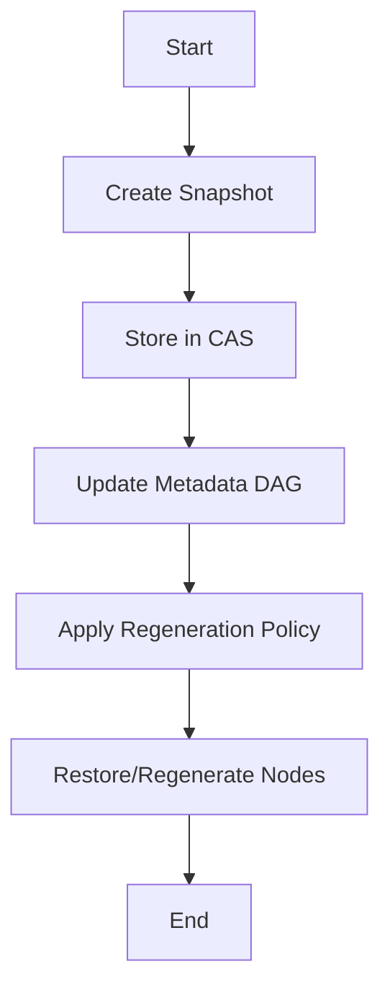

# Fluxo: Backup & Restore Incremental

## Diagrama

## Passos
1. Criar snapshot do estado atual do DAG
2. Armazenar outputs dos nós no CAS (endereçamento por hash)
3. Atualizar DAG de metadados com dependências e hashes
4. Aplicar política de regeneração (incremental, full, selective)
5. Restaurar nós por hash ou recomputar se necessário

## Políticas de Regeneração
- **Incremental:** Só restaura/recalcula o que mudou
- **Full:** Restaura tudo
- **Selective:** Usuário escolhe nós

## Interações Externas
- CAS (filesystem, S3, etc.)
- Orquestrador DAG
- Agentes de validação 