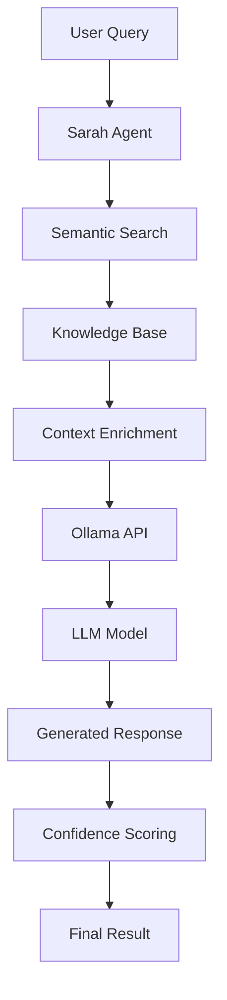

# Ollama Integration with Sarah Agent (RAG Engine)

## 🎯 Overview

The **Sarah Agent** serves as the **RAG (Retrieval-Augmented Generation) Engine** within the AikoRyu Autonomous Mesh System, providing seamless integration with **Ollama** for local LLM inference. This integration enables autonomous agents to access and synthesize knowledge through semantic search and context-aware response generation.

## 🏗️ Architecture

### Sarah Agent + Ollama Integration



### Core Components

1. **Sarah Agent**: RAG engine with autonomous capabilities
2. **Ollama Integration**: Local LLM inference engine
3. **Semantic Search**: Knowledge retrieval with relevance scoring
4. **Context Enrichment**: Enhanced context for better responses
5. **Model Management**: Dynamic model loading and switching

## 🚀 Quick Start

### Prerequisites

1. **Install Ollama**:
   ```bash
   # macOS/Linux
   curl -fsSL https://ollama.ai/install.sh | sh
   
   # Windows
   # Download from https://ollama.ai/download
   ```

2. **Start Ollama**:
   ```bash
   ollama serve
   ```

3. **Pull a Model**:
   ```bash
   ollama pull llama2
   ```

### Basic Usage

```typescript
import { SarahAgent } from './src/agents/SarahAgent';

// Initialize Sarah agent with Ollama
const sarahAgent = new SarahAgent({
  ollamaEndpoint: 'http://localhost:11434',
  defaultModel: 'llama2',
  knowledgeBase: [
    {
      id: 'doc-1',
      content: 'The AikoRyu system uses autonomous agents.',
      metadata: { title: 'Architecture', confidence: 0.9 }
    }
  ]
});

await sarahAgent.initialize();

// Retrieve knowledge
const result = await sarahAgent.retrieveKnowledge(
  'How does autonomous orchestration work?',
  { confidenceThreshold: 0.8 }
);

console.log(result.content);
console.log(`Confidence: ${result.confidence}`);
```

## 📚 Detailed Usage Examples

### 1. Model Management

```typescript
// List available models
const models = await sarahAgent.listAvailableModels();
console.log('Available models:', models.map(m => m.name));

// Load a specific model
const loadResult = await sarahAgent.loadModel('codellama');
if (loadResult.success) {
  console.log(`Model loaded in ${loadResult.loadTime}ms`);
}

// Unload model (cleanup)
await sarahAgent.unloadModel('codellama');
```

### 2. Knowledge Retrieval with Context

```typescript
const context = {
  userId: 'user-123',
  domain: 'system-architecture',
  confidenceThreshold: 0.8,
  maxTokens: 500,
  temperature: 0.7,
  ollamaModel: 'llama2'
};

const result = await sarahAgent.retrieveKnowledge(
  'Explain the benefits of autonomous agents in distributed systems',
  context
);

console.log('Response:', result.content);
console.log('Sources:', result.sources.length);
console.log('Confidence:', result.confidence);
console.log('Model used:', result.modelUsed);
console.log('Tokens used:', result.tokensUsed);
console.log('Response time:', result.responseTime);
```

### 3. Response Generation

```typescript
const response = await sarahAgent.generateResponse(
  'Compare Ollama with cloud-based LLM services',
  {
    temperature: 0.6,
    maxTokens: 300,
    ollamaModel: 'llama2'
  }
);

console.log('Generated text:', response.text);
console.log('Confidence:', response.confidence);
console.log('Latency:', response.latency);
```

### 4. Semantic Search

```typescript
const documents = [
  {
    id: 'doc-1',
    content: 'Autonomous agents can self-organize through declared dependencies.',
    metadata: { title: 'Agent Architecture' }
  },
  {
    id: 'doc-2',
    content: 'Ollama provides local LLM inference with high performance.',
    metadata: { title: 'Ollama Integration' }
  }
];

const searchResults = await sarahAgent.semanticSearch(
  'autonomous orchestration',
  documents
);

searchResults.forEach(result => {
  console.log(`Document: ${result.document.id}`);
  console.log(`Relevance: ${result.relevance}`);
  console.log(`Snippet: ${result.snippet}`);
});
```

### 5. Context Enrichment

```typescript
const enriched = await sarahAgent.contextEnrichment({
  userId: 'user-123',
  domain: 'ai-integration',
  confidenceThreshold: 0.8
});

console.log('Enriched data:', enriched.enrichedData);
console.log('Enrichment confidence:', enriched.confidence);
```

### 6. Knowledge Synthesis

```typescript
const sources = [
  {
    id: 'source-1',
    type: 'document',
    content: 'Autonomous agents provide self-organization capabilities.',
    confidence: 0.9
  },
  {
    id: 'source-2',
    type: 'document',
    content: 'Ollama enables local LLM inference with privacy benefits.',
    confidence: 0.85
  }
];

const synthesis = await sarahAgent.knowledgeSynthesis(sources);

console.log('Summary:', synthesis.summary);
console.log('Key insights:', synthesis.keyInsights);
console.log('Recommendations:', synthesis.recommendations);
```

## 🔧 Configuration

### Sarah Agent Configuration

```typescript
interface SarahAgentConfig {
  ollamaEndpoint?: string;        // Default: 'http://localhost:11434'
  defaultModel?: string;          // Default: 'llama2'
  knowledgeBase?: Document[];     // Initial knowledge base
}

const config = {
  ollamaEndpoint: 'http://localhost:11434',
  defaultModel: 'llama2',
  knowledgeBase: [
    // Your documents here
  ]
};
```

### Ollama Model Configuration

```typescript
// Available models
const models = [
  'llama2',           // General purpose
  'codellama',        // Code generation
  'mistral',          // Fast inference
  'llama2:13b',       // Larger model
  'llama2:7b-chat'    // Chat optimized
];

// Model-specific settings
const modelConfig = {
  temperature: 0.7,    // Creativity (0.0-1.0)
  maxTokens: 1000,     // Response length
  topP: 0.9,          // Nucleus sampling
  repeatPenalty: 1.1   // Repetition penalty
};
```

## 📊 Performance Optimization

### 1. Model Loading Strategy

```typescript
// Preload frequently used models
const commonModels = ['llama2', 'codellama'];
for (const model of commonModels) {
  await sarahAgent.loadModel(model);
}

// Use model-specific contexts
const codeContext = { ollamaModel: 'codellama', temperature: 0.3 };
const creativeContext = { ollamaModel: 'llama2', temperature: 0.8 };
```

### 2. Batch Processing

```typescript
// Process multiple queries concurrently
const queries = [
  'What is autonomous orchestration?',
  'How does RAG work?',
  'Explain semantic search'
];

const results = await Promise.all(
  queries.map(query => 
    sarahAgent.retrieveKnowledge(query, { maxTokens: 200 })
  )
);
```

### 3. Caching Strategy

```typescript
// Implement response caching
const cache = new Map();

async function cachedRetrieval(query: string, context: KnowledgeContext) {
  const cacheKey = `${query}-${JSON.stringify(context)}`;
  
  if (cache.has(cacheKey)) {
    return cache.get(cacheKey);
  }
  
  const result = await sarahAgent.retrieveKnowledge(query, context);
  cache.set(cacheKey, result);
  
  return result;
}
```

## 🧪 Testing and Validation

### Unit Tests

```typescript
describe('Sarah Agent Ollama Integration', () => {
  it('should retrieve knowledge with semantic search', async () => {
    const result = await sarahAgent.retrieveKnowledge(
      'How does the AikoRyu system work?',
      { confidenceThreshold: 0.7 }
    );
    
    expect(result.content).toBeDefined();
    expect(result.confidence).toBeGreaterThan(0.5);
    expect(result.sources).toHaveLength(1);
  });
});
```

### Performance Tests

```typescript
describe('Performance Benchmarking', () => {
  it('should handle concurrent queries efficiently', async () => {
    const queries = Array.from({ length: 10 }, (_, i) => 
      `Query ${i + 1}: Explain autonomous systems`
    );
    
    const startTime = Date.now();
    const results = await Promise.all(
      queries.map(query => sarahAgent.retrieveKnowledge(query))
    );
    const totalTime = Date.now() - startTime;
    
    expect(totalTime).toBeLessThan(30000); // 30 seconds
    expect(results.every(r => r.content.length > 0)).toBe(true);
  });
});
```

## 🚨 Error Handling

### Common Error Scenarios

```typescript
// 1. Ollama not running
try {
  await sarahAgent.retrieveKnowledge('test query');
} catch (error) {
  if (error.message.includes('ECONNREFUSED')) {
    console.error('Ollama is not running. Start with: ollama serve');
  }
}

// 2. Model not available
try {
  await sarahAgent.loadModel('non-existent-model');
} catch (error) {
  console.error('Model not found. Pull it first: ollama pull model-name');
}

// 3. Invalid query
try {
  await sarahAgent.retrieveKnowledge('');
} catch (error) {
  console.error('Query validation failed:', error.message);
}
```

### Recovery Strategies

```typescript
class ResilientSarahAgent extends SarahAgent {
  async retrieveKnowledge(query: string, context?: KnowledgeContext) {
    try {
      return await super.retrieveKnowledge(query, context);
    } catch (error) {
      // Fallback to cached responses
      return this.getCachedResponse(query);
    }
  }
  
  private getCachedResponse(query: string) {
    // Return cached response or default
    return {
      content: 'Service temporarily unavailable. Please try again later.',
      confidence: 0.5,
      sources: [],
      modelUsed: 'fallback',
      tokensUsed: 0,
      responseTime: 0,
      metadata: { fallback: true }
    };
  }
}
```

## 🔍 Monitoring and Observability

### Event Tracing

```typescript
// Sarah agent emits trace events
await sarahAgent.emitTrace('rag.knowledge.retrieved', {
  query: 'How does Ollama work?',
  result: {
    confidence: 0.85,
    responseTime: 1200,
    modelUsed: 'llama2'
  }
});
```

### Performance Metrics

```typescript
const metrics = {
  totalQueries: 0,
  averageResponseTime: 0,
  successRate: 0,
  modelsLoaded: 0,
  cacheHitRate: 0
};

// Update metrics on each query
function updateMetrics(result: KnowledgeResult) {
  metrics.totalQueries++;
  metrics.averageResponseTime = 
    (metrics.averageResponseTime * (metrics.totalQueries - 1) + result.responseTime) / 
    metrics.totalQueries;
}
```

## 🎯 DDD/SDD Alignment

### Design-Driven Development (DDD)

```typescript
// User research integration
interface UserResearch {
  personas: UserPersona[];
  painPoints: PainPoint[];
  needsAnalysis: UserNeed[];
}

// Design intent preservation
const designIntent = {
  userGoal: 'Access knowledge through natural language queries',
  businessValue: 'Improved decision making through AI assistance',
  technicalConstraints: ['Local inference', 'Privacy compliance'],
  successMetrics: ['Response accuracy', 'Query latency', 'User satisfaction']
};
```

### Specification-Driven Development (SDD)

```typescript
// Formal specification
interface SarahAgentSpecification {
  id: 'sarah';
  role: 'RAG Engine';
  capabilities: [
    'retrieveKnowledge',
    'generateResponse',
    'semanticSearch',
    'contextEnrichment'
  ];
  interfaces: ['SarahAgentContract'];
  validationRules: [
    'Query must not be empty',
    'Confidence threshold must be 0-1',
    'Response time must be < 10 seconds'
  ];
}

// Specification validation
const validation = await sarahAgent.validateSpecification(spec);
if (!validation.success) {
  console.error('Specification validation failed:', validation.errors);
}
```

## 🔮 Advanced Features

### 1. Multi-Model Orchestration

```typescript
// Route queries to appropriate models
async function routeQuery(query: string) {
  if (query.includes('code') || query.includes('programming')) {
    return await sarahAgent.retrieveKnowledge(query, {
      ollamaModel: 'codellama',
      temperature: 0.3
    });
  } else {
    return await sarahAgent.retrieveKnowledge(query, {
      ollamaModel: 'llama2',
      temperature: 0.7
    });
  }
}
```

### 2. Dynamic Model Loading

```typescript
// Load models on-demand based on query patterns
async function adaptiveModelLoading(query: string) {
  const modelMap = {
    'code': 'codellama',
    'creative': 'llama2',
    'fast': 'mistral'
  };
  
  const detectedType = detectQueryType(query);
  const modelName = modelMap[detectedType] || 'llama2';
  
  await sarahAgent.loadModel(modelName);
  return await sarahAgent.retrieveKnowledge(query, { ollamaModel: modelName });
}
```

### 3. Knowledge Base Evolution

```typescript
// Automatically update knowledge base based on query patterns
async function evolveKnowledgeBase(query: string, result: KnowledgeResult) {
  if (result.confidence < 0.6) {
    // Add to knowledge base for future reference
    await addToKnowledgeBase({
      id: `auto-${Date.now()}`,
      content: result.content,
      metadata: {
        source: 'auto-generated',
        confidence: result.confidence,
        query: query
      }
    });
  }
}
```

## 📈 Production Deployment

### Environment Setup

```bash
# Production environment variables
export OLLAMA_ENDPOINT=http://localhost:11434
export DEFAULT_MODEL=llama2
export MAX_TOKENS=1000
export CONFIDENCE_THRESHOLD=0.7
export CACHE_TTL=3600
```

### Health Checks

```typescript
async function healthCheck() {
  try {
    // Test Ollama connectivity
    const models = await sarahAgent.listAvailableModels();
    
    // Test knowledge retrieval
    const result = await sarahAgent.retrieveKnowledge(
      'health check',
      { maxTokens: 10 }
    );
    
    return {
      status: 'healthy',
      ollamaConnected: models.length > 0,
      knowledgeRetrieval: result.confidence > 0.5
    };
  } catch (error) {
    return {
      status: 'unhealthy',
      error: error.message
    };
  }
}
```

### Monitoring Dashboard

```typescript
// Real-time metrics
const dashboard = {
  queriesPerSecond: 0,
  averageResponseTime: 0,
  successRate: 0,
  activeModels: [],
  cacheHitRate: 0,
  errorRate: 0
};

// Update dashboard every second
setInterval(() => {
  console.log('Dashboard:', dashboard);
}, 1000);
```

## 🎉 Conclusion

The Sarah Agent with Ollama integration provides a powerful RAG engine that:

- ✅ **Enables local LLM inference** with privacy and performance benefits
- ✅ **Supports semantic search** for intelligent knowledge retrieval
- ✅ **Provides context-aware responses** through enrichment and synthesis
- ✅ **Maintains DDD/SDD alignment** with formal specifications and design intent
- ✅ **Offers comprehensive observability** with detailed tracing and metrics
- ✅ **Handles errors gracefully** with fallback strategies and recovery
- ✅ **Scales efficiently** with concurrent processing and caching

This integration demonstrates the AikoRyu system's capability to seamlessly incorporate external AI services while maintaining autonomous agent principles and rigorous validation standards.

---

**Related Tests**: [test/ollama-integration.test.ts](../../test/ollama-integration.test.ts)  
**Demo Script**: [ollama-demo.js](../../ollama-demo.js) 