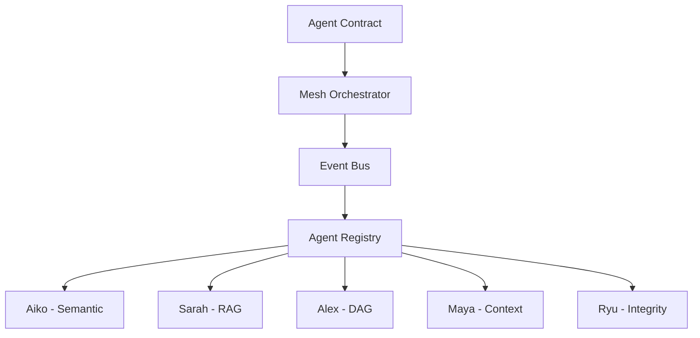

# System Overview

## O que é o AikoRyu Autonomous Mesh System?

- Sistema de orquestração autônoma baseado em DAG, com agentes autônomos, contratos imutáveis e rastreabilidade total.
- Suporta workflows distribuídos, backup incremental, validação DDD/SDD e integração com RAG.

## Arquitetura de Alto Nível

## Domínios/Módulos
- Aiko: Validação semântica
- Ryu: Integridade e compliance
- Sarah: RAG/Knowledge
- Alex: Orquestração DAG
- Maya: Contexto e estado

## Entry Points
- CLI: scripts utilitários
- API: endpoints REST/GraphQL (futuro)
- UI: dashboards (futuro)

## Glossário
- **Agent**: Unidade autônoma de execução
- **DAG**: Grafo acíclico direcionado
- **CAS**: Content-Addressable Storage
- **Snapshot**: Estado versionado do sistema
- **RAG**: Retrieval-Augmented Generation

## Links
- [Contratos de Módulos](./modules/)
- [Fluxos de Execução](./flows/)
- [Exemplos](./examples/)
- [Documentação Semântica](./semantic/) 